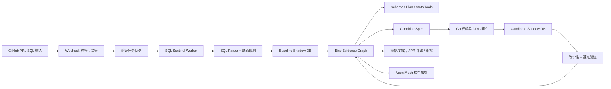

# SQL Sentinel：带影子库验证闭环的 SQL 诊断与 PR 评审 Agent

## 1. 项目目标

SQL Sentinel 面向 GitHub PR 中的 SQL Migration 和显式 Raw SQL 字符串，自动发现数据库风险并生成可验证的优化建议。

它不允许 LLM 直接“优化 SQL”或执行 DDL。确定性规则、表结构、执行计划和影子库实测构成证据；Eino Agent 只负责选择下一步取证、生成受限候选方案和解释结果。

## 2. 首版输入范围

- `.sql` migration 文件；
- Go 源码中的显式 Raw SQL 字符串字面量；
- 手动上传的慢 SQL 模板及其参数样本。

首版不静态还原 GORM 链式调用。动态条件、运行时拼接和 ORM 行为会使静态提取准确率不可接受，应在 README 中明确为已知边界。

## 3. 核心原则

1. **证据约束**：LLM 不猜答案；结论必须指向本次规则、Schema、Plan 或验证结果。
2. **受限候选**：LLM 输出 `CandidateSpec`，Go 校验后才编译成 DDL 或 SQL 改写。
3. **影子验证**：候选索引和改写只能在隔离影子 MySQL 中验证。
4. **置信度分级**：弱证据不伪装成实测结论。
5. **无副作用诊断**：读 SQL 可在影子库 `EXPLAIN ANALYZE`；写 SQL 默认只做 `EXPLAIN FORMAT=JSON`。

## 4. 总体架构



## 5. 证据置信度

| 级别 | 证据 | 可以说什么 |
| --- | --- | --- |
| L0 | SQL AST、静态规则 | 存在静态风险，尚未验证 |
| L1 | Schema、索引、统计、EXPLAIN | 优化器计划级推断 |
| L2 | 可控分布基准数据、影子库 EXPLAIN ANALYZE、重复测量 | 基准数据集验证通过 |
| L3 | 脱敏代表性数据或工作负载回放 | 代表性工作负载验证通过 |

历史案例只能作为候选生成的 `Historical Prior`，不得作为本次最终报告的验证证据。

## 6. Eino Graph 设计

Graph State 建议包含：

```text
request / parsed_sql / baseline_plan / evidence[] / hypotheses[]
candidate_specs[] / validation_results[] / confidence / tool_budget
elapsed_budget / report / unresolved_assumptions
```

节点建议：

1. `Admission`：验证输入范围、SQL 类型、安全策略和预算；
2. `StaticAnalysis`：运行 AST 规则，生成初始风险；
3. `BaselineEvidence`：读取 Schema、索引、统计，获得 Baseline Plan；
4. `DecideNextEvidence`：Agent 选择下一个只读 Tool；
5. `ExecuteTool`：执行列类型、索引、统计、Plan、慢日志等 Tool；
6. `GenerateCandidateSpec`：仅输出结构化候选；
7. `ValidateCandidate`：校验、编译、在 Candidate 影子库验证；
8. `Evaluate`：判断结果集等价、读收益与写入代价；
9. `StopOrLoop`：证据充分则结束，否则在预算内回到取证；
10. `Report`：输出已确认结论、置信度和未验证假设。

循环上限建议：最多 3 轮 Tool 决策、最多 2 个候选索引、总耗时与 Token 均有限额。达到上限时必须 graceful degradation，不得强行给出优化结论。

## 7. CandidateSpec 与安全

示例：

```json
{
  "kind": "add_index",
  "table": "orders",
  "columns": ["user_id", "status", "created_at"],
  "order": ["ASC", "ASC", "ASC"],
  "reason": "...",
  "evidence_ids": ["plan-001", "schema-002"]
}
```

Go 校验器必须验证：库表字段是否存在、索引列数量与类型、索引名、白名单 DDL、重复索引、存储预算和任务权限。校验通过后才允许在影子库执行。

生产库永不执行 CandidateSpec；生产场景只生成带审批信息的建议。

## 8. 影子库与可信计时

### 阶段 0：必须先完成的 Spike

- 使用 Go 造数或 sysbench 构造高/低基数、Zipf 倾斜、NULL 比例可控的数据；先 100 万行跑通，再根据硬件扩至 500 万行；
- 构建 Baseline 与 Candidate 两套独立 MySQL 容器，确保数据快照一致；
- Baseline 测量、候选索引创建、`ANALYZE TABLE`、Candidate 测量形成完整对比；
- 正常 SQL 多次预热和重复执行，记录中位数/P95；`EXPLAIN ANALYZE` 主要用于 actual rows、loops 和 iterator 证据；
- 每个固定环境先独立完成至少 20 轮噪声标定，记录 `noise_floor = MAD(latency) / median(latency)`；每个 baseline/candidate Case 再至少重复 5 轮；
- 噪声地板原则上低于 10%，且只有中位数变化超过 `2 × noise_floor` 才报告为收益；MAD 对长尾延迟比 RSD 更稳健；
- 所有验证任务按影子库串行执行，避免 CPU、IO 与 Buffer Pool 干扰；
- 报告环境、MySQL 版本、Buffer Pool 配置、数据集版本、规则集和模型版本。

### 写入代价与等价性

- 每个候选索引除读取收益外，测量单写和 N 并发 INSERT/UPDATE 的吞吐、P95、锁等待、索引大小和建索引耗时；
- “不建议建索引”必须覆盖两类反例：低选择性/小表使优化器全扫更优；以及读查询变快但并发写入代价超过约定阈值；
- SQL 改写必须做语义等价性验证：带 `ORDER BY` 的查询比较顺序，无排序查询比较结果多重集合；处理字段类型与 NULL 语义；
- 大结果集使用稳定序列化、分块哈希与行数校验，必要时全量比较。

手工注入 `innodb_table_stats` / `innodb_index_stats` 和自定义 Histogram 属于计划模拟实验，不替代代表性数据上的真实验证。

## 9. 技术栈与选型理由

| 技术 | 用途 | 为什么需要 |
| --- | --- | --- |
| Go + database/sql | 计划、统计、影子库控制 | 诊断核心需要精确 SQL 控制，不能完全交给 ORM |
| MySQL 8.0.18+ | EXPLAIN ANALYZE、统计、索引验证 | 项目的主目标数据库 |
| Eino Graph / Tool / Callback | 受限多轮取证与可观测 | Agent 负责决策，不承担确定性校验 |
| RabbitMQ 或 Redis Streams | 耗时验证队列、串行资源调度 | 影子库验证会互相干扰且需要任务状态机 |
| MySQL + GORM | 任务、报告、审批、CandidateSpec | 常规业务状态持久化 |
| Redis | Webhook 短期去重、任务状态缓存 | 热路径防重和状态读取 |
| Go-zero | Webhook、管理 API、审批接口 | HTTP 管理面需求清晰 |
| JWT + Casbin | 库表级查看与审批权限 | 诊断与审批属于高风险操作 |
| Docker Compose / Testcontainers | 隔离双影子库 | 验证环境必须可复现 |
| Zap + Viper + Go test | 日志、配置、规则与集成测试 | 保证调试和复现能力 |

可选扩展：ES 用于历史实测数据检索、过滤和聚合；PostgreSQL 用于一次性跨引擎执行计划对照实验。两者不是 MVP 依赖。

## 10. 数据模型（建议）

- `review_tasks`：输入、状态、预算、租户、PR 信息；
- `evidence_items`：来源、内容摘要、级别、版本、关联任务；
- `candidate_specs`：结构化候选、校验状态、审批状态；
- `validation_runs`：环境、噪声标定的 `noise_floor_mad_ratio`、基线/候选指标、写压指标、等价性结果；
- `reports`：最终报告、置信度、未验证假设；
- `webhook_deliveries`：Delivery ID、签名状态、幂等状态；
- `prompt_versions` / `ruleset_versions` / `dataset_versions`：可复现性元数据。

## 11. 验收与评测

- 静态规则召回率：人工注入的已知坏味道被发现的比例；
- 最优接近度：Agent 方案耗时 / 预定义候选方案中最优耗时；
- 结果等价性：改写方案的语义校验通过率；
- 验证通过率：候选方案在影子库实测优于基线的比例；
- 安全性：非法 CandidateSpec、越权审批、Webhook 重放和超时降级测试；
- 成本：单次分析耗时、工具轮数、Token 用量。

## 12. 推荐目录

```text
sql-sentinel/
  cmd/{api,worker,verifier,datagen}/
  internal/{webhook,parser,rules,evidence,agent,candidate,validator,benchmark,approval}/
  pkg/{mysqlplan,contracts}/
  migrations/
  deployments/docker-compose.yml
  datasets/
  tests/{unit,integration,benchmark}/
```

## 13. 阶段 0 本地运行步骤（已实测）

环境：Windows 本机跑 Go，MySQL 仅以两个独立 Docker 容器提供，不使用 WSL。
本机需已安装 Go 1.26+ 与 Docker Desktop（含 Compose v2）。

### 启动双影子库

```bash
docker compose -f deployments/docker-compose.yml up -d --build
```

两个容器：`sqlsentinel-baseline`（127.0.0.1:13306）、`sqlsentinel-candidate`（127.0.0.1:13307）。
`my.cnf` 通过 `deployments/mysql/Dockerfile` 以 `COPY --chmod=0644` 烧进镜像 ——
用 Windows bind mount 挂载会让配置在容器内变成 world-writable，MySQL 会静默忽略它，
参数回落默认值（buffer pool 128M、`time_zone=SYSTEM`），测量环境即失去可信性。

确认两侧参数真的生效：

```bash
docker exec sqlsentinel-baseline mysql -uroot -psentinel -e \
  "SELECT VERSION(), @@time_zone, @@innodb_buffer_pool_size, @@performance_schema"
```

### 造数、校验、建候选索引、测量

```bash
go run ./cmd/sentinel seed   --rows 1000000 --seed 42 --target both
go run ./cmd/sentinel verify --seed 42
go run ./cmd/sentinel index  --target candidate
go run ./cmd/sentinel bench  --calibrate 20 --rounds 0 --out calibration-1.json
go run ./cmd/sentinel bench  --calibrate 20 --rounds 5 --out validation_result.json
```

顺序不可调换，且由程序强制：

- 两侧在**无候选索引**状态下各自确定性造数（行内容只由 `(seed, rowIndex)` 决定，
  因此无需 dump/restore 同步快照）；
- `verify` 按主键升序分块算 SHA-256，两侧不一致直接拒绝；
- `index` 只接受 `--target candidate`，对 `baseline` 会拒绝且不发出任何 DDL；
- `index` 与 `bench` 在动手前都**现场重算**两侧快照，不复用上一条命令的结果；
  `bench` 还要求两侧 MySQL 版本一致且 candidate 候选索引存在。

### 验证

```bash
go build ./... && go vet ./... && go test -count=1 ./...
```

### 已知限制

100 万行下 candidate 侧中位数约 2.9ms，scaled MAD 约 0.38ms，噪声比 13%，
超过阶段 0 约定的 10% 门槛。噪声比是相对量，查询越快越难达标。
因此当前环境**不足以据此声称读收益**，详见
[specs/001-trusted-ab-measurement/plan.md](specs/001-trusted-ab-measurement/plan.md) 的 Spike 记录。

### 报告消费规则

`verdict=Better` 只表示本次统计测量的方向性结果，**不等于**已经取得性能收益证据。
任何人、脚本或后续 Agent 只有在报告中读取到
`admission.eligible_for_performance_claim=true` 时，才可以将该报告用于声称性能收益；
否则必须以 `admission.evidence_level` 和 `admission.rejection_reasons` 说明证据等级与拒绝原因。

已有的 `validation_result.json` 与 `calibration-1.json` 是历史原始实验记录，不回填新增字段；
重新运行 `bench` 生成的新报告才会包含 `admission` 块。

### 批量轮次实验（N=10）

为降低极快查询被调度抖动主导的风险，`bench` 支持
`--executions-per-round N`：每个样本连续完整执行 N 次同一 prepared SQL，
再以 `batch_elapsed / N` 记录单次折算耗时；报告的
`measurement_protocol.executions_per_round` 会记录这一口径。

在同一份 100 万行数据、相同快照与候选索引上，N=1 的 candidate 标定噪声为 16.57%；
N=10 的两次独立 20 轮标定分别为 6.38% 与 **10.19%**（baseline 为 0.86% 与 1.63%）。
N=10 正式测量内部标定为 baseline 2.34%、candidate 9.62%，测量中位数为
148.433ms → 2.634ms，单次报告的方向判定为 `Better`。

但是阶段协议要求两次独立标定都不超过 10%，第二次未通过。因此本批实验的**整体证据仍为 L1**，
不得据此声称性能收益。`batched-n10-validation.json` 中的 L2 只基于它自身那一次标定，
尚未表达跨报告的稳定性要求；后续应把“多次运行的系列准入”设计成独立功能，而不是选择性忽略失败报告。

### 跨运行系列准入

使用 `admit-series` 汇总预先指定的两份以上 calibration 报告和一份正式 measurement 报告：

```bash
go run ./cmd/sentinel admit-series \
  --calibration batched-n10-calibration-1.json \
  --calibration batched-n10-calibration-2.json \
  --measurement batched-n10-validation.json \
  --out series_admission.json
```

命令会拒绝 dataset version、快照摘要、MySQL 版本、Query Case、候选索引或
`executions_per_round` 不一致的输入，也拒绝重复使用同一份 calibration 报告充数。
只有所有 calibration 的两侧噪声均不超过 10%，且 measurement 自身为 `Better`、单份准入合格时，
才输出系列 `eligible_for_performance_claim=true` / `L2`。

对当前三份 N=10 报告，实际输出为 `false` / `L1`，原因是
`calibration_noise_exceeds_limit (batched-n10-calibration-2.json)`；输入报告不会被修改。

## 14. CandidateSpec：候选索引的受限输出

Agent 不能直接输出或执行 DDL。它只能给出 `CandidateSpec` JSON，Go 会严格解码、校验并预览确定性 DDL：

```bash
go run ./cmd/sentinel candidate-preview --in examples/candidate-index.json
```

输出示例：

```sql
CREATE INDEX `idx_cand_user_status_created` ON `orders` (`user_id` ASC, `status` ASC, `created_at` DESC)
```

该命令只读取文件并输出 stdout，不连接 MySQL、不会执行 DDL。Spec 只允许普通二级索引、1–4 个安全标识符列，
索引名必须以 `idx_cand_` 开头；`sql`、`ddl` 等未知字段会被拒绝，不能作为自由 SQL 通道。

## 15. 只读 SQL 准入（L0 静态信号）

在把一条 SQL 交给后续影子库取证前，可先执行本地、无副作用的准入检查：

```bash
go run ./cmd/sentinel sql-admit --in examples/read-only-query.sql
```

示例输出：

```json
{"accepted":true,"evidence_level":"L0","signals":["select_star","leading_wildcard_like"]}
```

该命令只接受单条 `SELECT` 或 `WITH ... SELECT`，会拒绝空输入、多语句、DDL/DML、
`INTO OUTFILE` / `DUMPFILE`、`FOR UPDATE` 和 `LOCK IN SHARE MODE`。扫描时忽略字符串、
反引号标识符和普通注释中的关键字或分号；MySQL 可执行注释会保守拒绝。命令只读取文件并写 JSON 到 stdout，
不连接 Docker 或 MySQL，也绝不执行 SQL。

`signals` 仅是需要继续调查的静态 L0 线索（目前包括 `select_star`、`leading_wildcard_like`、
`function_on_probable_column`），不是性能结论；任何优化判断仍须由 schema、`EXPLAIN` 和影子库验证支撑。

## 16. Candidate 影子库 EXPLAIN 门禁

在已通过 `seed` 与 `verify`、且 baseline/candidate 快照一致的前提下，使用受限 CandidateSpec
在 candidate 影子库创建或复用候选索引，并取得执行计划：

```bash
go run ./cmd/sentinel candidate-explain \
  --sql examples/candidate-explain-query.sql \
  --candidate examples/candidate-explain-index.json \
  --out candidate_explain_report.json
```

该命令在连接数据库前先复用 `sql-admit` 和严格 CandidateSpec 校验；随后检查两侧 MySQL 版本、
现场重算 `orders` 数据快照，并在 candidate 确认表/列与同名索引定义。只有 candidate 会执行受限
`CREATE INDEX` 和 `ANALYZE TABLE`；baseline 仅用于版本和快照门禁，绝不接收 DDL。输入 SQL 仅以
`EXPLAIN FORMAT=JSON` 形式提交，原 SQL 不会执行。

输出报告包含快照、MySQL 版本、L0 静态信号、确定性候选 DDL、索引创建状态和 EXPLAIN JSON。它固定标为
L1，`eligible_for_performance_claim=false`：计划显示了什么并不等于该索引有性能收益；要得出收益结论仍须执行
受控 A/B 测量并通过既有的准入门槛。

## 17. Baseline/Candidate EXPLAIN 对照

当需要把“candidate 的计划是什么”扩展为“它与没有候选索引的 baseline 有何计划差异”时，运行：

```bash
go run ./cmd/sentinel explain-compare \
  --sql examples/candidate-explain-query.sql \
  --candidate examples/candidate-explain-index.json \
  --out explain_comparison_report.json
```

该命令先执行与 `candidate-explain` 相同的 SQL、CandidateSpec、MySQL 版本、快照、candidate schema
与索引定义门禁。随后 baseline 和 candidate 都只运行 `EXPLAIN FORMAT=JSON`，候选侧可创建或复用受限索引并
`ANALYZE TABLE`；baseline 永不接收 DDL，原 SQL 也不会执行。

对照报告同时保留两侧原始 JSON，并只提取可稳定陈述的访问事实：表访问方式、候选/实际索引、预计扫描行数、
覆盖索引与 filesort 状态。示例实测中 baseline 为全表扫描且 `uses_filesort=true`，candidate 使用
`idx_cand_status_amount`、`uses_filesort=false`。报告固定为 L1 且
`eligible_for_performance_claim=false`；预计扫描行数、cost 或 filesort 差异都是计划证据，不是性能收益结论。

## 18. 受限诊断假设

在已经生成 L1 EXPLAIN 对照报告后，可将其中已有事实转换为后续取证用的机器可读假设：

```bash
go run ./cmd/sentinel diagnose-plan \
  --in explain_comparison_report.json \
  --out diagnostic_hypotheses.json
```

命令只读取严格的本项目 L1 对照 JSON；未知字段、多个 JSON 值、非 L1 输入或已经具备性能收益资格的输入都会拒绝。
输出会记录输入文件 SHA-256、快照与 MySQL 版本，并且仅在事实存在时生成稳定的诊断码：
`candidate_index_removes_filesort`、`candidate_index_changes_access_path`、
`candidate_index_reduces_estimated_scan`。

这不是索引建议，也不会连接 MySQL、执行 SQL 或 DDL。每条假设都明确要求先经过
`controlled_ab_measurement` 与 `series_admission`；诊断报告固定为 L1 且
`eligible_for_performance_claim=false`。
