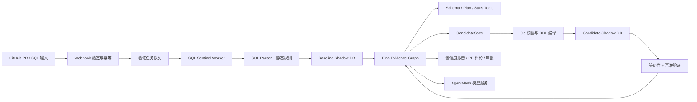

# SQL Sentinel：带影子库验证闭环的 SQL 诊断与 PR 评审 Agent

## 1. 项目目标

SQL Sentinel 面向 GitHub PR 中的 SQL Migration 和显式 Raw SQL 字符串，自动发现数据库风险并生成可验证的优化建议。

它不允许 LLM 直接“优化 SQL”或执行 DDL。确定性规则、表结构、执行计划和影子库实测构成证据；Eino Agent 只负责选择下一步取证、生成受限候选方案和解释结果。

## 2. 首版输入范围

- `.sql` migration 文件；
- Go 源码中的显式 Raw SQL 字符串字面量；
- 手动上传的慢 SQL 模板及其参数样本。

首版不静态还原 GORM 链式调用。动态条件、运行时拼接和 ORM 行为会使静态提取准确率不可接受，应在 README 中明确为已知边界。

## 3. 核心原则

1. **证据约束**：LLM 不猜答案；结论必须指向本次规则、Schema、Plan 或验证结果。
2. **受限候选**：LLM 输出 `CandidateSpec`，Go 校验后才编译成 DDL 或 SQL 改写。
3. **影子验证**：候选索引和改写只能在隔离影子 MySQL 中验证。
4. **置信度分级**：弱证据不伪装成实测结论。
5. **无副作用诊断**：读 SQL 可在影子库 `EXPLAIN ANALYZE`；写 SQL 默认只做 `EXPLAIN FORMAT=JSON`。

## 4. 总体架构



## 5. 证据置信度

| 级别 | 证据 | 可以说什么 |
| --- | --- | --- |
| L0 | SQL AST、静态规则 | 存在静态风险，尚未验证 |
| L1 | Schema、索引、统计、EXPLAIN | 优化器计划级推断 |
| L2 | 可控分布基准数据、影子库 EXPLAIN ANALYZE、重复测量 | 基准数据集验证通过 |
| L3 | 脱敏代表性数据或工作负载回放 | 代表性工作负载验证通过 |

历史案例只能作为候选生成的 `Historical Prior`，不得作为本次最终报告的验证证据。

## 6. Eino Graph 设计

Graph State 建议包含：

```text
request / parsed_sql / baseline_plan / evidence[] / hypotheses[]
candidate_specs[] / validation_results[] / confidence / tool_budget
elapsed_budget / report / unresolved_assumptions
```

节点建议：

1. `Admission`：验证输入范围、SQL 类型、安全策略和预算；
2. `StaticAnalysis`：运行 AST 规则，生成初始风险；
3. `BaselineEvidence`：读取 Schema、索引、统计，获得 Baseline Plan；
4. `DecideNextEvidence`：Agent 选择下一个只读 Tool；
5. `ExecuteTool`：执行列类型、索引、统计、Plan、慢日志等 Tool；
6. `GenerateCandidateSpec`：仅输出结构化候选；
7. `ValidateCandidate`：校验、编译、在 Candidate 影子库验证；
8. `Evaluate`：判断结果集等价、读收益与写入代价；
9. `StopOrLoop`：证据充分则结束，否则在预算内回到取证；
10. `Report`：输出已确认结论、置信度和未验证假设。

循环上限建议：最多 3 轮 Tool 决策、最多 2 个候选索引、总耗时与 Token 均有限额。达到上限时必须 graceful degradation，不得强行给出优化结论。

## 7. CandidateSpec 与安全

示例：

```json
{
  "kind": "add_index",
  "table": "orders",
  "columns": ["user_id", "status", "created_at"],
  "order": ["ASC", "ASC", "ASC"],
  "reason": "...",
  "evidence_ids": ["plan-001", "schema-002"]
}
```

Go 校验器必须验证：库表字段是否存在、索引列数量与类型、索引名、白名单 DDL、重复索引、存储预算和任务权限。校验通过后才允许在影子库执行。

生产库永不执行 CandidateSpec；生产场景只生成带审批信息的建议。

## 8. 影子库与可信计时

### 阶段 0：必须先完成的 Spike

- 使用 Go 造数或 sysbench 构造高/低基数、Zipf 倾斜、NULL 比例可控的数据；先 100 万行跑通，再根据硬件扩至 500 万行；
- 构建 Baseline 与 Candidate 两套独立 MySQL 容器，确保数据快照一致；
- Baseline 测量、候选索引创建、`ANALYZE TABLE`、Candidate 测量形成完整对比；
- 正常 SQL 多次预热和重复执行，记录中位数/P95；`EXPLAIN ANALYZE` 主要用于 actual rows、loops 和 iterator 证据；
- 每个固定环境先独立完成至少 20 轮噪声标定，记录 `noise_floor = MAD(latency) / median(latency)`；每个 baseline/candidate Case 再至少重复 5 轮；
- 噪声地板原则上低于 10%，且只有中位数变化超过 `2 × noise_floor` 才报告为收益；MAD 对长尾延迟比 RSD 更稳健；
- 所有验证任务按影子库串行执行，避免 CPU、IO 与 Buffer Pool 干扰；
- 报告环境、MySQL 版本、Buffer Pool 配置、数据集版本、规则集和模型版本。

### 写入代价与等价性

- 每个候选索引除读取收益外，测量单写和 N 并发 INSERT/UPDATE 的吞吐、P95、锁等待、索引大小和建索引耗时；
- “不建议建索引”必须覆盖两类反例：低选择性/小表使优化器全扫更优；以及读查询变快但并发写入代价超过约定阈值；
- SQL 改写必须做语义等价性验证：带 `ORDER BY` 的查询比较顺序，无排序查询比较结果多重集合；处理字段类型与 NULL 语义；
- 大结果集使用稳定序列化、分块哈希与行数校验，必要时全量比较。

手工注入 `innodb_table_stats` / `innodb_index_stats` 和自定义 Histogram 属于计划模拟实验，不替代代表性数据上的真实验证。

## 9. 技术栈与选型理由

| 技术 | 用途 | 为什么需要 |
| --- | --- | --- |
| Go + database/sql | 计划、统计、影子库控制 | 诊断核心需要精确 SQL 控制，不能完全交给 ORM |
| MySQL 8.0.18+ | EXPLAIN ANALYZE、统计、索引验证 | 项目的主目标数据库 |
| Eino Graph / Tool / Callback | 受限多轮取证与可观测 | Agent 负责决策，不承担确定性校验 |
| RabbitMQ 或 Redis Streams | 耗时验证队列、串行资源调度 | 影子库验证会互相干扰且需要任务状态机 |
| MySQL + GORM | 任务、报告、审批、CandidateSpec | 常规业务状态持久化 |
| Redis | Webhook 短期去重、任务状态缓存 | 热路径防重和状态读取 |
| Go-zero | Webhook、管理 API、审批接口 | HTTP 管理面需求清晰 |
| JWT + Casbin | 库表级查看与审批权限 | 诊断与审批属于高风险操作 |
| Docker Compose / Testcontainers | 隔离双影子库 | 验证环境必须可复现 |
| Zap + Viper + Go test | 日志、配置、规则与集成测试 | 保证调试和复现能力 |

可选扩展：ES 用于历史实测数据检索、过滤和聚合；PostgreSQL 用于一次性跨引擎执行计划对照实验。两者不是 MVP 依赖。

## 10. 数据模型（建议）

- `review_tasks`：输入、状态、预算、租户、PR 信息；
- `evidence_items`：来源、内容摘要、级别、版本、关联任务；
- `candidate_specs`：结构化候选、校验状态、审批状态；
- `validation_runs`：环境、噪声标定的 `noise_floor_mad_ratio`、基线/候选指标、写压指标、等价性结果；
- `reports`：最终报告、置信度、未验证假设；
- `webhook_deliveries`：Delivery ID、签名状态、幂等状态；
- `prompt_versions` / `ruleset_versions` / `dataset_versions`：可复现性元数据。

## 11. 验收与评测

- 静态规则召回率：人工注入的已知坏味道被发现的比例；
- 最优接近度：Agent 方案耗时 / 预定义候选方案中最优耗时；
- 结果等价性：改写方案的语义校验通过率；
- 验证通过率：候选方案在影子库实测优于基线的比例；
- 安全性：非法 CandidateSpec、越权审批、Webhook 重放和超时降级测试；
- 成本：单次分析耗时、工具轮数、Token 用量。

## 12. 推荐目录

```text
sql-sentinel/
  cmd/{api,worker,verifier,datagen}/
  internal/{webhook,parser,rules,evidence,agent,candidate,validator,benchmark,approval}/
  pkg/{mysqlplan,contracts}/
  migrations/
  deployments/docker-compose.yml
  datasets/
  tests/{unit,integration,benchmark}/
```
